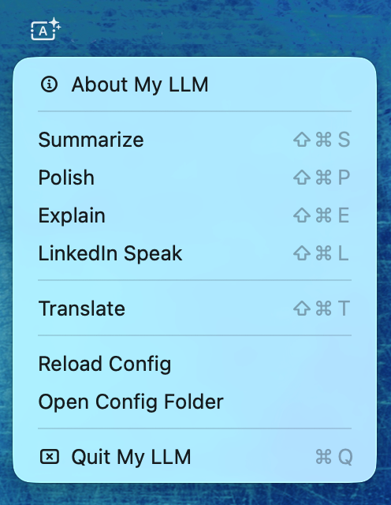
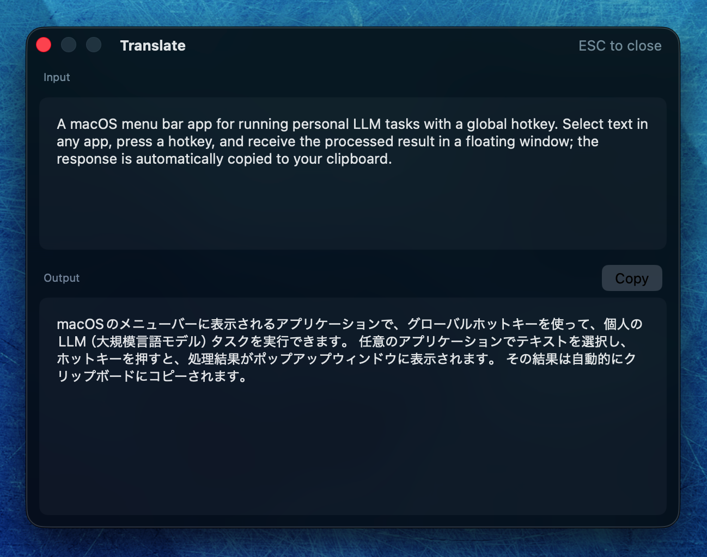

# My LLM Classic

A macOS menu bar app for running personal LLM tasks with a global hotkey. Select text in any app, press a hotkey, and receive the processed result in a floating window; the response is automatically copied to your clipboard.

This repository is the frozen Classic GUI. New development lives in [myllm](https://github.com/rinodrops/myllm).

Powered by [myllm-cli](https://github.com/rinodrops/myllm-cli). All LLM logic lives in the companion shell script; the app is a thin macOS shell around it.

## Features

- **Menu bar app** — always available, zero dock clutter
- **Global hotkeys** — trigger any task from any app (configured per task in `config.toml`)
- **Selected text capture** — automatically uses the currently selected text; falls back to clipboard
- **Streaming output** — results stream into the window in real time
- **Auto-copy** — result is copied to the clipboard when processing completes (configurable)
- **Translation** — automatic source language detection via bundled `whichlang-cli`
- **Local & cloud providers** — Ollama (local), OpenAI, Anthropic
- **Frosted glass window** — floating, non-intrusive; dismiss with ESC or the close button
- **Configurable appearance** — dark (default), light, or follows the system theme

## Requirements

- macOS 13.0 Ventura or later
- A running [Ollama](https://ollama.com) instance, or an OpenAI / Anthropic API key
- **Accessibility permission** — required for selected text capture (prompted on first launch)

No Homebrew, no Python, no runtime dependencies. All binaries (`jq`, `whichlang-cli`, `myllm`) are bundled inside the app.

## Installation

1. Download `My LLM-*.zip` from [Releases](https://github.com/rinodrops/myllm-classic/releases)
2. Unzip and move `My LLM.app` to `/Applications`
3. Launch the app — it appears in the menu bar
4. On first launch, a starter `~/.config/myllm/config.toml` is created automatically
5. Edit the config to add your providers, models, and tasks (see [Configuration](#configuration))
6. Grant **Accessibility** permission when prompted (System Settings → Privacy & Security → Accessibility)

## Usage

### Via hotkey

Assign a `hotkey` to each task in `config.toml`:

```toml
[tasks.polish]
hotkey = "cmd+shift+p"
```

Select text in any app, press the hotkey. The app captures the selection, processes it, and shows the result. When done, the result is automatically copied to your clipboard (unless `auto_copy = false`).

Hotkey syntax: `modifier+key` or `modifier+modifier+key`. Supported modifiers: `cmd`, `ctrl`, `opt` (or `alt`), `shift`. The key must be a single character (e.g., `cmd+shift+p`, `ctrl+opt+t`).

### Via menu bar



Click the menu bar icon to see all configured tasks and translation. Click any item to run it against the current clipboard contents.

The menu also provides:

- **Reload Config** — picks up changes to `config.toml` without restarting the app
- **Open Config Folder** — opens `~/.config/myllm/` in Finder
- **Quit My LLM** — exits the app

### Result window



The window is split into two panes:

- **Input** (top) — the text captured from your selection or clipboard, shown for reference
- **Output** (bottom) — the LLM response, streamed in real time as it is generated

The output scrolls automatically during streaming. You can scroll up at any time to review earlier content; scrolling back to the bottom re-enables auto-scroll. Once processing completes, a **Copy** button appears in the output header to copy the result manually.

## Configuration

The single configuration file lives at `~/.config/myllm/config.toml`. A fully annotated starter config is created on first launch.

### Providers

```toml
[general]
default_provider = "ollama"
auto_copy = true           # Copy result to clipboard automatically
# appearance = "dark"      # Window theme: dark (default), light, system

[providers.ollama]
base_url = "http://localhost:11434"
default_model = "llama3.2"
keep_alive = "5m"          # Keep model loaded this long after use

# [providers.openai]
# base_url = "https://api.openai.com/v1"
# default_model = "gpt-4o"
# api_key = "sk-..."                     # Direct — simpler
# api_key_env = "MYLLM_OPENAI_API_KEY"  # Or read from env var

# [providers.anthropic]
# base_url = "https://api.anthropic.com/v1"
# default_model = "claude-sonnet-4-6"
# api_key = "sk-ant-..."                      # Direct
# api_key_env = "MYLLM_ANTHROPIC_API_KEY"    # Or read from env var
```

### Tasks

```toml
[tasks.polish]
name = "Polish"
hotkey = "cmd+shift+p"
instruction = '''
Improve the clarity, flow, and correctness of the provided text.
Fix grammar, punctuation, and word choice. Preserve the original meaning and tone.
Output only the revised text, no explanation.
'''
```

Optional per-task overrides: `provider`, `model`, `auto_copy`.

### Translation

```toml
[translation]
enabled = true
provider = "ollama"
model = "translategemma:12b"
hotkey = "cmd+shift+t"
default_source = "en"     # Assumed source when detection is unavailable
default_target = "ja"     # Target when source matches default_source
fallback_target = "en"    # Target for all other detected languages
```

Language detection is automatic via bundled `whichlang-cli` (16 languages supported). Install the translation model with `ollama pull translategemma:12b`.

## Accessibility Permission

My LLM uses the Accessibility API to send ⌘C to the frontmost app and capture selected text. Without this permission, it falls back to using whatever is already on the clipboard.

If the permission prompt does not appear (common after rebuilding from source), go to:
**System Settings → Privacy & Security → Accessibility** and enable My LLM there.

## Building from Source

Requires Xcode Command Line Tools (`xcode-select --install`).

```bash
# Clone
git clone https://github.com/rinodrops/myllm-classic.git
cd myllm-classic

# Quick build (current architecture, for development)
make build
# Binary: build/myllm-gui

# Full app bundle (universal binary, downloads all dependencies)
make bundle
# App: release/My LLM.app
```

### Distribution pipeline

```bash
# Set required environment variables
export APPLE_DEVELOPER_CERTIFICATE_NAME="Developer ID Application: ..."
export APPLE_DEVELOPER_KEYCHAIN_PROFILE="myllm-notary"

# One-time notarization credential setup
make notary-setup

# Full pipeline: bundle → sign → notarize → zip
make dist
# Output: release/My LLM-*.zip
```

### Make targets

| Target | Description |
|---|---|
| `make build` | Compile current-arch binary (fast dev iteration) |
| `make build-universal` | Compile universal binary (arm64 + x86_64) |
| `make bundle` | Build full `.app` bundle, download all dependencies |
| `make sign` | Code-sign with hardened runtime |
| `make notarize` | Submit to Apple, staple ticket, verify Gatekeeper |
| `make zip` | Create distributable ZIP |
| `make dist` | Full pipeline: `bundle → sign → notarize → zip` |
| `make clean` | Remove `build/` and `release/` |

## Project Structure

```
myllm/
├── MyllmGui.swift     # Single-file Swift source
├── Makefile           # Build, bundle, sign, notarize, distribute
├── Info.plist         # App bundle metadata
├── entitlements.plist # Hardened runtime entitlements
└── AppIcon.icns       # App icon
```

The core LLM engine is in [myllm-cli](https://github.com/rinodrops/myllm-cli). The GUI sources the `myllm` shell script and calls its functions directly.

## License

MIT License. See [LICENSE](LICENSE).
